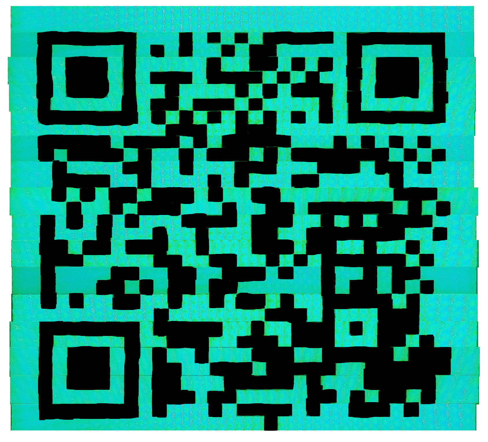

# Haunted screen - writeup

**Points: 150**

**Author: Chabz**

**Difficulty: challenging**

**Category: AFK**

---
The screen is showing what appears
to be some kind of QR code. Trying to
scan it does not work, it's moving and
flickering too much. We can try to 
take a picture of it:

So it is a QR code, but the lines have 
been shuffled around. Luckily the ghost
has marked the lines, so we just have
to put them back in order. There are 
probably different ways of doing this,
but some kind of photo editing tool
should work nicely (I used MS Paint...):

You might be able to scan the QR code
now, but the app I used didn't work
on this code. So I tried filling in 
the black parts of the code:

Success! I scanned the code and got the flag:
`TG19{good_thing_we_called_ghostbusters}`

