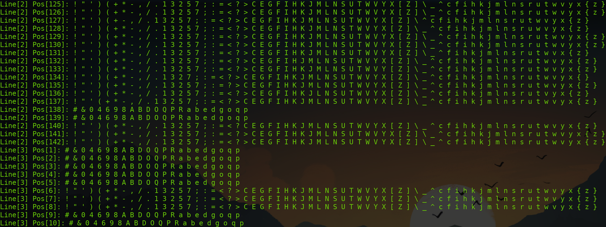
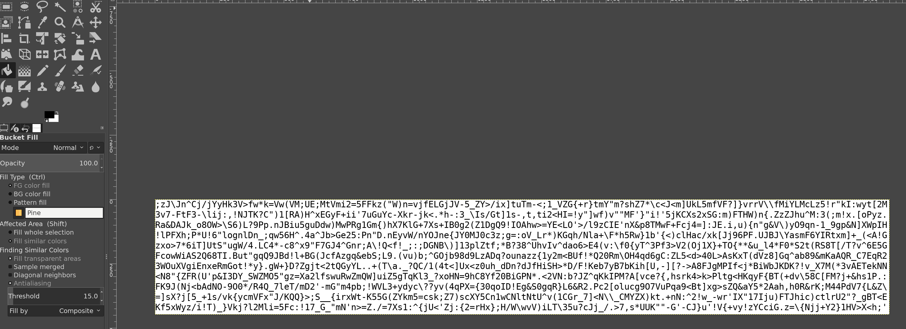
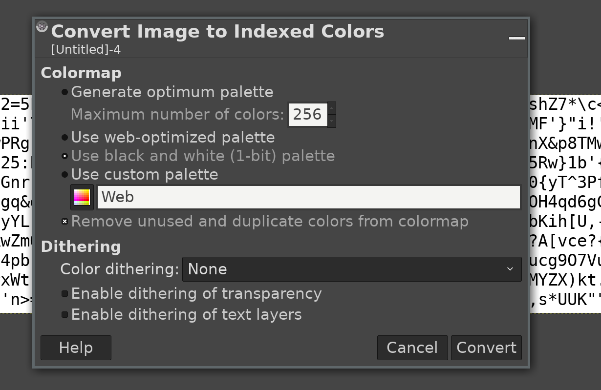

# Writeup [Counter Play](README.md)

**Points: 200**

**Author: zup**

**Difficulty: hard**

**Category: misc**

---

Let's connect to the service to see what all the fuzz is about...

`nc counterplay.tghack.no 2018`

When connected, I get the following text back:

```
     ___      ,_,        ___
    (o,o)    (o,o)   ,,,(o,o),,,
    {`"'}    {`"'}    ';:`-':;'
    -"-"-    -"-"-      -"-"-
Here you go! Have some fresh ASCII text:

r;,N5?'E2V,\WW.Knz?VVF]=>J-r>1wJ*.cHt5L!yxzhHTyz*XywE+.M_XF(Sk,.jKH/LSGy[-{;N.V;Ztnr=ncixy)'!c=Xvvtk,x<<7FK[h?Znz7cV;J}Si7k(/35mn'5K3s5?.=WnUC
cT{w*CJZwUnlvZ(7{UT;?JlfW=#dHtjVN/X]<wJJ'FXwJ=lJZx51-hyIMh'y;.)lT]('}cZmIrsEfs^-,;Mx}Z'5iU5j?}M"s(:<{Hm,-]F/:+<,f:lu['zG)!*G[<L}U7V<{+3tIR8c:s
oD89dM3xg4&t;5l4SKca&QKJ,eif?e}&bIH/X8O8_UY\YE=N,[GIs-\[Wqg9I>_yDOb&MMdO53^[]Tx*p"5jvB{kT{Z:zpo9v3>M(vvw4lM=z!kuCJU",{&d]*EsQPPG7NUO&d#">Lup}]
)rQE^m]aGS-bIXAet:a[[I0w]Qy/}AqiNqisR=Ihp/?dsInz52cl7g*C4h\nOCWA{jFCqY,&lUtTuUHJ0*H[Jp2[lht'4js_9:1E>]j_q!]Ny1^zgo8.(2^#HcNg/l>B3+9JyittZ2Vq<r
TK9xV59Z,CICj^:8tyPvsk8v'Gd-(e_\>I'acEiW.q1Ho2nyHUf28vnqLjGHfPH{*=KvA!Xb:HlCYkXD6DRl]#s.H*ZpH.(y3DCSJ<>hg>h*'Z"P3Y-eVtuO!l4hW[x38<A_THv].IgG}h
>:A^.:DT3BdDyi"dML=8gee-oR^M5b=K3Yw#'#D6QeIUc#';2I+4!JU4VR&gaa]!qB4FQkSAX:f.T3FwP+k!y#<BPfw9)P80RaIiv)H1a/09/;9(?]{y6Wua"FaIdD9Oou:gAPB+^>!eq^
x"6f7Y8SWVwpa\<o)")3}*bx/7O*z8H1I\fb/c).[7u;L}Rl.+PKC]xd,j(SML'#TNV9QV^#S-c5jl^VP\>*1boUub(es}huxJ\\.+HGBg:Ce!ofk{(L4KTQZEP[17^SuCNFKWvb(^ak{'
1ZQ++;ubYjyBBwmpYk"L/<P!*o*>\a':Nj^jd,KZdGkfFwuauO{Sljuj4+/,BiZorK;aaC"#(jy?;kJta?7fYqh}sQ1"6;[Fq1V]z<f'Bzsubr=bwh?gmM=d1y;47v2AjjKZN,{4[NIQz"
m,a>H-VZARP.q2Dg#"y9DPmVXo_2jD>-,V_5s#pa7?\-ZCzTO7kG_s2\NeQpL"!{AeAvdSnQ&\BdqRX2Q8dX26*iJpE!kpDRSVFeaB4NdjMcRkV*D6&2Wkn8R]vWbaqy+sC6p0BC?=UpyZ
iK,+2rf2ix',"+k+(rJ)-i^MjIQ&l>SE>"]K/,\G>Lskn/h1xf![V{1fJ^rx<2,<yHS:V1EtVln21x:}U(VC5xLs3w_/H{Y!>Jl(]uxyH'yN7^rH"X{G1scWM+]TUFyZ3r^>M}Hr1P0_yC
N/k/ncN{xN=^/G=l3yLCw>}FnY72,KX5-:7<_2[W\T5!-'3LUF<w<h)HC1'(3"__V(1Z3LU1u(?<]"*!JXJy[--h^JS}VXF,[*EI"2v>>ymMufzhcFNlL=S2]:S?fkfy^tH[;U/zSG/nr"
```

As the task states, the text consists of ASCII characters, but it just looks like random data. 
If I try to connect one more time, the text is totally different... 
Let's put the obfuscated text in a file called `obfuscated.txt` for now.

How can we find out what the true meaning behind this ASCII text is? 
Maybe a script that fetches the ASCII data multiple times can help us on our way.

Here is a script for creating statistics of the occurrences of characters in the data.

```python
#!/usr/bin/env python
from pwn import *

chmap = {}

for x in range(300):
    line = 0
    r = remote('counter.tghack.no', 2018)
    _ = r.recvuntil("text:\n\n")
    data = r.recvall()
    
    pos = 0
    for ch in data:
        if ch == '\n':
            line += 1
            pos = 0 
            continue
        if line not in chmap:
            chmap[line] = {}
        if pos not in chmap[line]:
            chmap[line][pos] = {}
        if ch not in chmap[line][pos]:
            chmap[line][pos][ch] = 1
            
        chmap[line][pos][ch] += 1
        
        pos += 1
        
    log.info(data)
    r.close()
    
with open('statistics.txt', 'a') as f:
    for line in chmap:
        for pos in chmap[line]:
            v = [] 
            for ch in chmap[line][pos]:
                v.append("%s:%d" % (ch)) # chmap[line][pos][ch]))
            log.info("Line[%s] Pos[%s]: %s" % (line+1, pos+1, ' '.join(v)))
            f.write(("Line[%s] Pos[%s]: %s\n" % (line+1, pos+1, ' '.join(v))))
```


The script fetches data 300 times and stores all of the character occurrences in a file. 
If we take a look at the statistics, we can see that there are positions in the data where 
only certain characters are used:

```
Line[2] Pos[125]: ! " ' ) ( + * - , / . 1 3 2 5 7 ; : = < ? > C E G F I H K J M L N S U T W V Y X [ Z ] \ _ ^ c f i h k j m l n s r u t w v y x { z }
Line[2] Pos[126]: ! " ' ) ( + * - , / . 1 3 2 5 7 ; : = < ? > C E G F I H K J M L N S U T W V Y X [ Z ] \ _ ^ c f i h k j m l n s r u t w v y x { z }
Line[2] Pos[127]: ! " ' ) ( + - , / . 1 3 2 5 7 ; : = < ? > C E G F I H K J M L N S U T W V Y X [ Z ] \ ^ c f i h k j m l n s r u t w v y x { z }
Line[2] Pos[128]: ! " ' ) ( + * - , / . 1 3 2 5 7 ; : = < ? > C E G F I H K J M L N S T W V Y X [ Z ] \ _ ^ c f i h k j m l n s r u w v y x { z }
Line[2] Pos[129]: ! " ' ) ( + * - , / . 1 3 2 5 7 ; : = < ? > C E G F I H K J M L N S U T W V Y X [ Z ] \ _ ^ c f i h k j m l n s r u t w v y x { z }
Line[2] Pos[130]: ! " ' ) ( + * - , / . 1 3 2 5 7 ; : = < ? > C E G F I H K J M L N S U T W V Y X [ Z ] \ _ ^ c f i h k j m l n s r u t w v y x { z }
Line[2] Pos[131]: ! " ' ) ( + * - , / . 1 3 2 5 7 ; : = < ? > C E G F I H K J M L N S U T W V Y X [ Z ] \ _ ^ f i h k j m l n s r u t w v x { z }
Line[2] Pos[132]: ! " ' ) ( + * - , / . 1 3 2 5 7 ; : = < ? > C E G F I H J M L N S U T W V Y X [ Z ] \ _ ^ c f i h k j m l n s r u t w v y x { z }
Line[2] Pos[133]: ! " ' ) ( + * - , / . 1 3 2 5 7 ; : = < ? > C E G F I H K J M L N S U T W V Y [ Z ] \ _ ^ c f i h k j m l n s r u t w v y x { z }
Line[2] Pos[134]: ! " ' ) ( + * - , / . 1 3 2 7 ; : = < ? > C E G F I H K J M L N S U T W V Y X [ Z ] \ _ ^ c f i h k j m l n s r u t w v y x { }
Line[2] Pos[135]: ! " ' ) ( + * - , / . 1 3 2 5 7 ; : = ? > C E G F I H K J M L N S U T W V Y X [ Z ] \ _ ^ c f i h k j m l n s r u t w v y x { z }
Line[2] Pos[136]: ! " ' ) ( + * - , / . 1 3 2 5 7 ; : = < ? > C E G F I H K J L N S U T W V Y X [ Z ] \ _ ^ c f i h k j m l n s r u t v y x { z }
Line[2] Pos[137]: ! " ' ( + * - , / . 1 3 2 5 7 ; : = < ? > C E G F I H K J M L N S U T W V Y X [ Z ] \ _ ^ c f i h k j m l n s r u t w v y x { z }
Line[2] Pos[138]: # & 0 4 6 9 8 A B D O Q P R a b e d g o q p
Line[2] Pos[139]: # & 0 4 6 9 8 A B D O Q P R a b e d g o q p
Line[2] Pos[140]: ! " ' ) ( + * - , / . 1 3 2 5 7 ; : = < ? C E G F I H K J M L N S U T W V Y X [ Z ] \ _ ^ c f i h k j m l n s r u t w v y x { z }
Line[2] Pos[141]: ! " ' ) ( + * - , / . 1 3 2 5 7 ; : = < ? > C E G F I H K J M L N S U T W V Y X [ Z ] \ _ ^ c f i h k j m l n s r u t w v y x { z }
Line[2] Pos[142]: ! " ' ) ( + * - , / . 1 3 2 5 7 ; : = < ? > C E G F I H K J M L N S U T W V Y X [ Z ] \ _ ^ c f i h k j m l n s r u t w v y x { z }
Line[3] Pos[1]: # & 0 4 6 9 8 A B D O Q P R a b e d g o q p
Line[3] Pos[2]: # & 0 4 6 9 8 A B D O Q P R a b e d g o q p
Line[3] Pos[3]: # & 0 4 6 9 8 A B D O Q P R a b e d g o q p
Line[3] Pos[4]: # & 0 4 6 9 8 A B D O Q P R a b e d g o q p
Line[3] Pos[5]: # & 0 4 6 9 8 A B D O Q P R a b e d g o q p
Line[3] Pos[6]: ! " ' ) ( + * - , / . 1 3 2 5 7 ; : = < ? > C E G F I H K J M L N S U T W V Y X [ Z ] \ _ ^ c f i h k j m l n s r u t w v y x { z }
Line[3] Pos[7]: ! " ' ) ( + * - , / . 1 3 2 5 7 ; : = < ? > C E G F I H K J M L N S U T W V Y X [ Z ] \ _ ^ c f i h k j m l n s r u t w v y x { z }
Line[3] Pos[8]: ! " ' ) ( + * - , / . 1 3 2 5 7 ; : = < ? > C E G F I H K J M L N S U T W V Y X [ Z ] \ _ ^ c f i h k j m l n s r u t w v y x { z }
Line[3] Pos[9]: # & 0 4 6 9 8 A B D O Q P R a b e d g o q p
Line[3] Pos[10]: # & 0 4 6 9 8 A B D O Q P R a b e d g o q p
```



For example on _Line[3] Position[4]_, the characters  `#`, `&`, `0`, `4`, `6`, `9`, `8`, `A`, 
`B`, `D`, `O`, `Q`, `P`, `R`, `a`, `b`, `e`, `d`, `g`, `o`, `q` and `p` have been used. 
Also, none of these characters are used in the longer lines on the image above. 
One of the longer lines on the image is _Line[2] Position[135]_. It uses many characters 
like `!`, `3`, `E` and `G`, but not one of the characters found on _Line[3] Position[135]_. 
That means there is something fishy going on here! After looking at the statistics for all of 
the positions of characters in the data, the conclusion is that there are two sets of characters. 
Some positions use a longer set of characters while other positions uses a shorter set of characters:

**Set 1:** `#&46890ABDOPQRabdegopq`

**Set 2**: `!^*()_-=+]}[{'"\?/.>,<;:12357CEFGHIJKLMNSTUVWXYZcfhijklmnrstuvwxyz`

Okay, so we got this far! But what is the difference between the characters in each set?

There is a typography term called __Counter__. 

> In [typography](https://en.wikipedia.org/wiki/Typography), a **counter** is the 
[area of a letter](https://en.wikipedia.org/wiki/Typeface_anatomy) that is entirely or 
partially enclosed by a letter form or a symbol.

Check out __counter__ on [Wikipedia](<https://en.wikipedia.org/wiki/Counter_(typography)>) for more info.

All of the characters in set 1 have enclosed areas inside of them, while the characters in set 2 does not.

Maybe there is a message hidden in the counters of the characters? Let's try filling all of the counters 
with a different color to see if there is anything hidden there!

I found a program online created by _Yusuke Endoh_ ([@mametter](https://twitter.com/mametter)) which was 
a category winner in the _25th International Obfuscated C Code Contest (2018)_: "Best tool to reveal holes". 
Get the program [here](<http://ioccc.org/2018/endoh1/prog.c>), and compile it using _gcc_ or the 
provided [Makefile](http://ioccc.org/2018/endoh1/Makefile). What this program does is to convert the 
ASCII text from _stdin_ to a GIF and printing it to _stdout_. The GIF fades everything to black except for 
letters with enclosed areas inside of them (the __counters__). Those enclosed areas remain white. 
Let's test the program to see if we get anything interesting.

`make && ./prog < obfuscated.txt > flag.gif`

When displaying the GIF animation using `eog flag.gif`: 


_Waving wand_, __Revelio__! I got the flag!

```
TG19{reveal_the_holes}
```


Another way to solve this challenge is to convert the text file to an image and edit it in Gimp or Photoshop.

1. Open the image in Gimp:



2. Convert the image to black and white (1-bit) palette



3. Use the bucket fill tool and fill the white background with black.


__Revelio__!

There are also other ways to solve this challenge that I won't explain any further:

- Print the text on paper and use a pen to fill in all the __counter__ areas.
- Create your own script that creates a GIF like the one above.
