# Writeup [So music](readme.md)

**Points: 500**

**Author: kristebo**

**Difficulty: hard**

**Category: misc**


This audio file sounds a little weird. We can open it in an audio tool such as audacity to look at the waveform.
It is a mono audio track at 48kHz. From the name we can guess that this is FM: frequency modulation. 
It is received and demodulated, but maybe it contains more data.

Let's investigate more:

## The Audio:
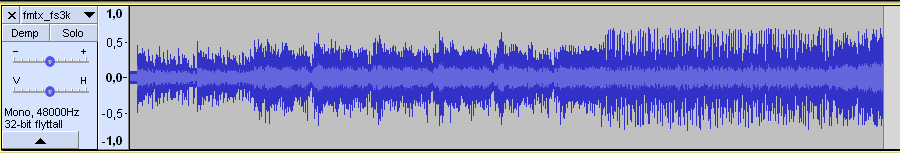

Zoomed in we discover something interesting. The audio has squibly things in repeating patterns. INTERESTING!
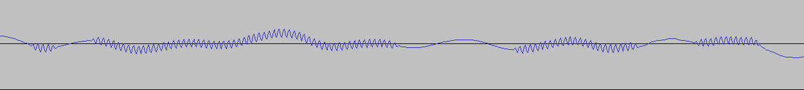


We can also open the file in Sonic Visualizer:

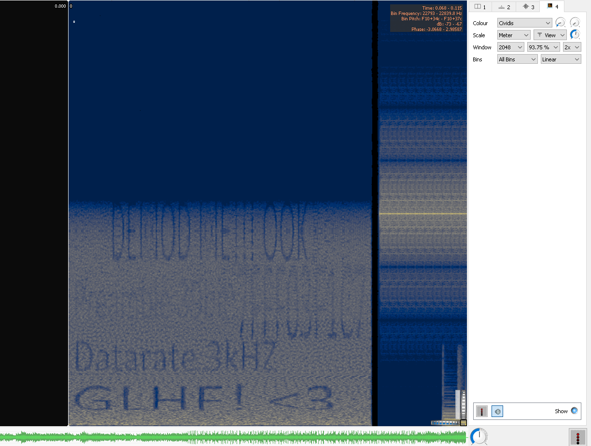

At the start of the file we see some text.

```
Demod me || OOK
Preamble 39 bit
7FFF03F1C7
Datarate 3kHZ
GLHF! <3
```

`Fs=3kHz`

`7FFF03F1C7` in binary is: `111111111111111000000111111000111000111`

This is the preamble and will be important later!
We also know the _msglen_ and that the message is ASCII.
In simulink add a variable called rec, with all these constants.
We need to open the file and remove this part before we continue.

# OOK
We can see in the waveform is repetative modulated onto the audio signal, we can guess that this is OOK, as we also see in sonic visualizer.
On Off keying is the simplest form for ASK (amplitude shift keying). It is often used for transmission of data.

So how can we decode this?
One way is to go through the following steps:
* IIR Peak filter at 12kHz - We know the signal has a center frequency F_s at 12kHz
* Absolute value - Let the now filtered signal be positive!
* Lowpass filter (calculate coefficients) - Filter out noise and unwanted parts of the sound signal
* Mean along columns and filtered signal. - If we let the signal be as it is, we will have a signal with 
highs and lows at different levels. We use mean to normalize the signal.
* Lookup for the binary data - We need the 1 and -1 for the next part.
* Downsample to Fs - The sample rate of the sound is 48kHz, transmitted sample rate is 3kHz. 
* Convert to ASCII - Based on the fact that we are looking for a flag. We can guess ASCII.

Let's do this in Matlab and simulink.


## Peak-filter:


Since we're going to do some signal processing we will be using matlab and simulink. This is easier than Python (scipy) and gives the best result. Solving this using [GRC](https://wiki.gnuradio.org/index.php/GNURadioCompanion) is also possible.

First we need to filter out the signal with center around 12kHz.
To filter out this we use a peak filter with carrier frequency at 12kHz.
The peak filter has these parameters:

- F_s=12kHz
- q=20


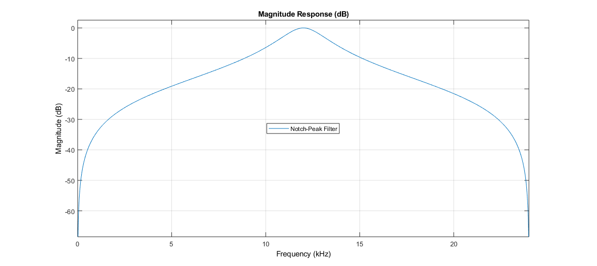

Then we demodulate the signal:
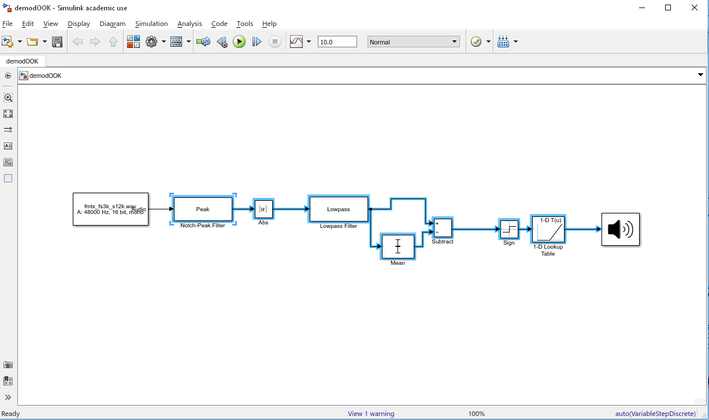

After demodulation our signal looks like this:

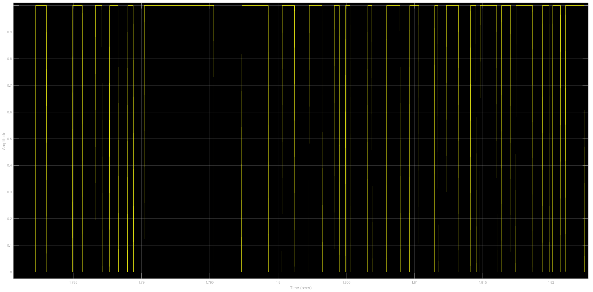


## Matched filter and decode to ascii
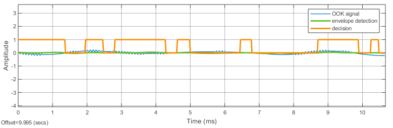

We now have a demodulated OOK-signal.

Because we have an oversampled bit stream, we need to downsample the signal to a lower sample rate before we 
continue to make a binary stream. We need to sample down the signal to the data rate transmitted, which is 3KHz.


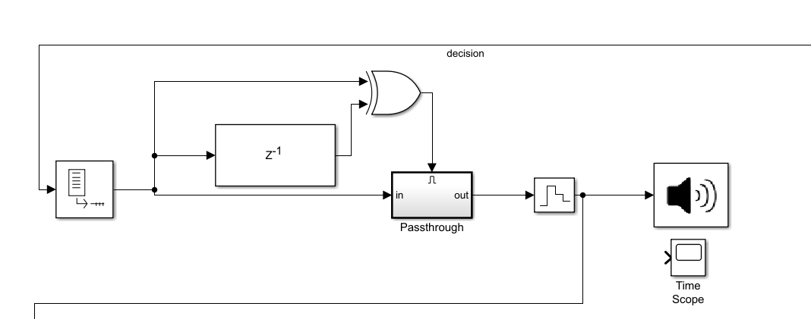


A latch is implemented by processing a delayed signal and the original signal through an XOR (strobe). The passthrough is enabled when the XOR output is high. The ZOH operates as an ADC.

## Matched filter

The matched Filter is a FIR filter with the time reversed preamble as coefficients:
```
The Matched Filter block implements matched filtering of an input signal.
Matched filtering is an FIR filtering operation with the coefficients equal to the time reversed samples of the transmitted signal.
```

Time reversed/conjugated preamble:
```
1 1 1 -1 -1 -1 1 1 1 -1 -1 -1 1 1 1 1 1 1 -1 -1 -1 -1 -1 -1 1 1 1 1 1 1 1 1 1 1 1 1 1 1 1
```

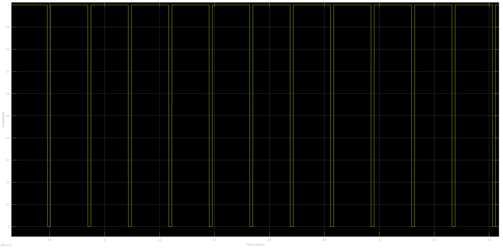

This is done to synchronize the signal. Because we have a continuous signal we need to guess where the symbols are.
Symbol timing synchronization is used in most communication systems because of the lack of a common timing reference.
Without synchronization, phase and frequency timing goes uncorrected, causing errors on the receiving end.

To synchronize we use TED (Timing Error Detection). We use a latching to sample the output of the matched filter and a loop to count samples. We call this the synthesized symbol clock.

The TED generates an error signal that instructs the timing to be adjusted.
We can implement TED in many different ways. This TED is a maximum likelihood TED and a NCC (normally controlled clock).


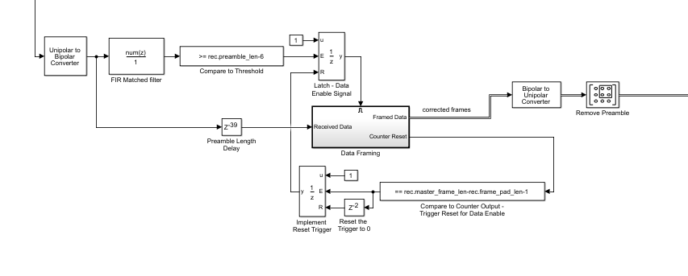


And now we have binary:

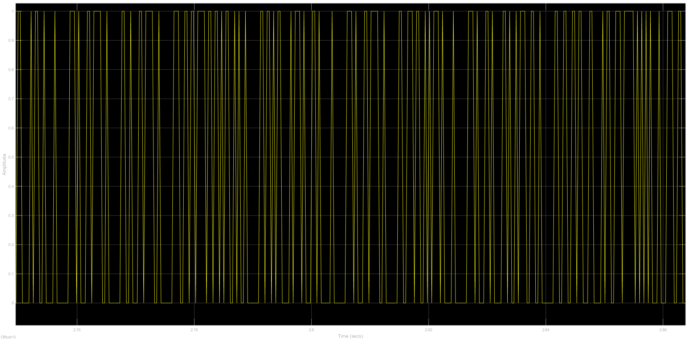

We can guess ASCII and try to create ASCII at 8 bit width:

```
function msg_decoder(msg,msg_len,ascii_len)

% assert limits of msg_len for compiler
  assert(msg_len>=1)
  assert(msg_len<=2000)

  % enable functions to be used by compiler
  coder.extrinsic('uicontrol')
  coder.extrinsic('disp')
  coder.extrinsic('num2str')

  % initialise output word with zeros
  word = char(zeros(1,msg_len));

  % convert ascii bits to ascii chars, save to string
  for count = 1:1:msg_len
      char_bin = msg((((count-1)*ascii_len)+1):ascii_len*count)';
      word(count) = char(bi2de(double(char_bin),'left-msb'));
    end
  disp(word);    
end
```

[demodOOK.slx](src/demodOOK_done.slx)

If all went well we should have a flag:

```
flag: TG19{you had to do some math to get this flag}
```
