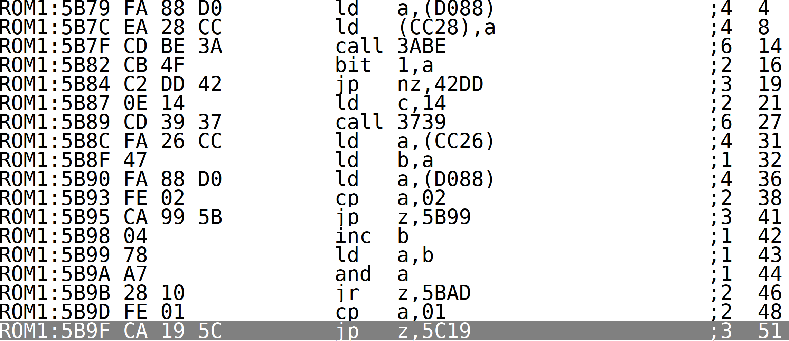
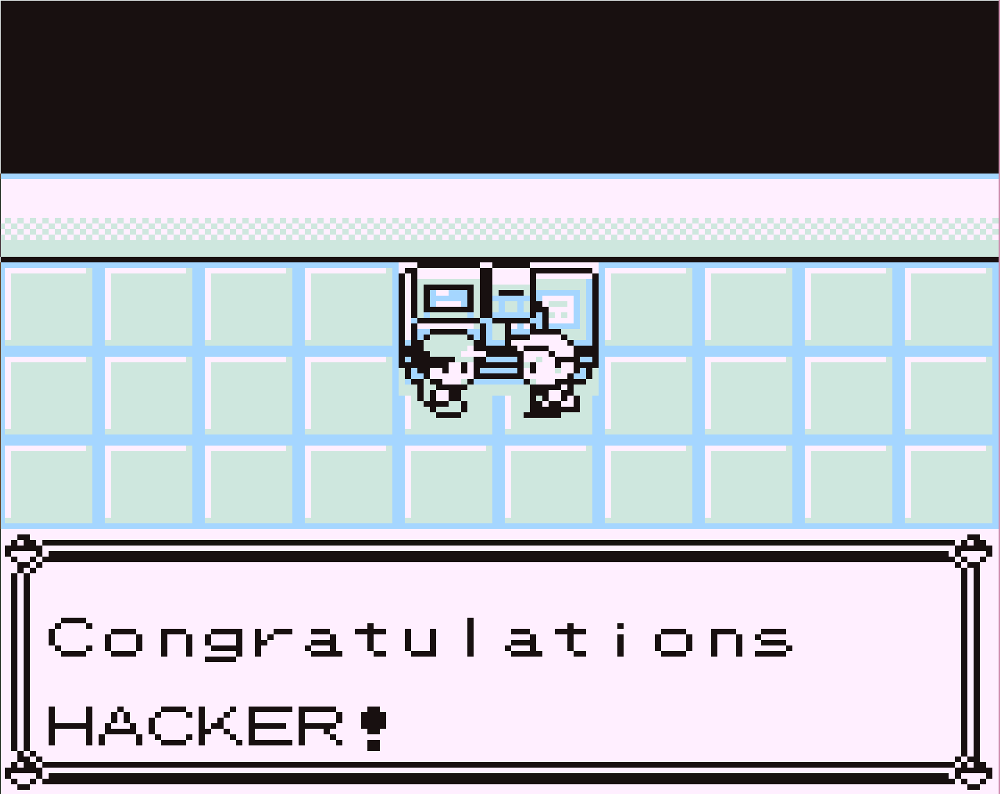
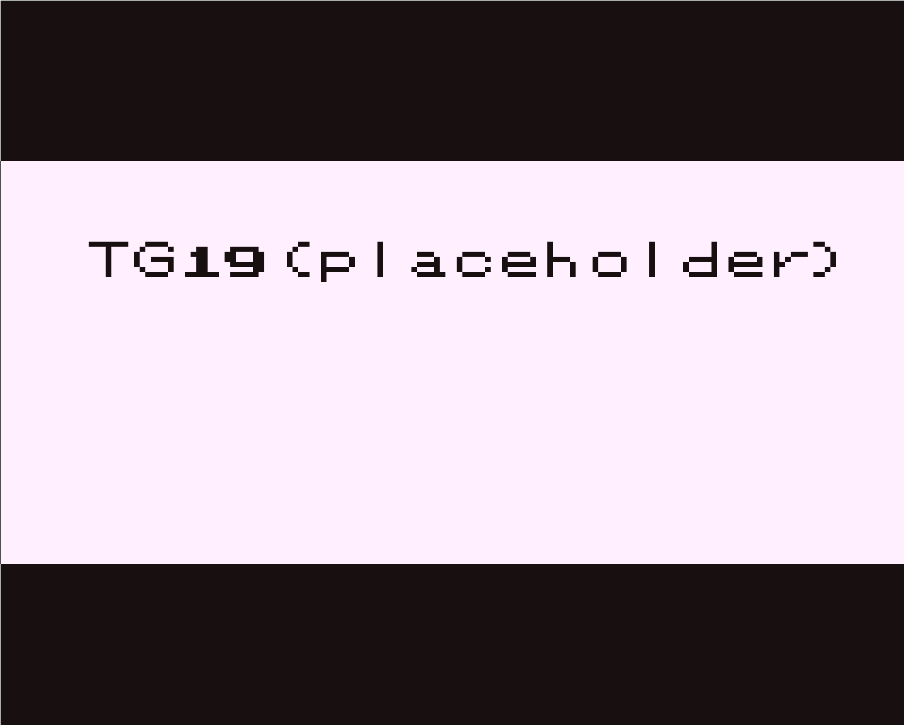

# Gotta Catch 'Em All Writeup

Okay, so we have to build a ROM of Pokemon red for this challenge!

We start by building pokered like this:

```bash
$ git clone https://github.com/rednex/rgbds /opt/rgbds
$ cd /opt/rgbds
$ make install
$ git clone https://github.com/pret/pokered.git /opt/pokered
$ cd /opt/pokered
$ make red
```

After running these commands, you should end up with `pokered.gbc` in the
`pokered` directory.

The final step of building the correct ROM is to apply the patch we are given.
```bash
$ bspatch pokered.gbc pokered_patched.gbc ./pokered.patch
```
If you want to use symbols later, rename `pokered.sym` to `pokered_patched.sym`.


The next step is to actually load the ROM into an emulator, so we can see what
the goal of the task is. One nice emulator that has a good debugger is
[BGB](http://bgb.bircd.org/). It runs on Windows and in
[Wine](https://www.winehq.org/).

When we boot up the emulator, we're greeted with the normal Pokemon
introduction. However, when we choose "new game" we are asked for a password!

Now we have to find the password!
We can start by figuring out where the password-checking code should be located.
One way to do this is to find the function that is supposed to run when we
select "new game". Thankfully, we have the source code for pokered, so we can
use that to aid our reverse engineering.

The code flow that we are interested in is basically: `MainMenu` ->
`StartNewGame`. Both of these are located in `engine/menu/main_menu.asm`.

To help us find the function that checks the password, we can use the
`pokered.sym` file from when we compiled the ROM. First, looking at the
`MainMenu` function at `0x5af2`. We can follow the code flow until the jump
to `StartNewGame`, which is at `0x5b9f`:


Following is the code for `StartNewGame` (0x5c19):
```asm
StartNewGame:
        ld		hl, D158
        xor		a
        ld		(D07D), a
        call	64CF
        ld		a, (CF4B)
        cp		a, 50
        jr		z, StartNewGame
        ld		hl, D158
        ld		de, 5FD4
        ld		c, 0A
        call	3A8E
        xor     a
        cp		c
        jr		z, 5C49
        call	602A
        ld		hl, D158
        ld		bc, 10
        xor     a
        call	36E0

        jp		StartNewGame

5C49:
        ld		hl, 5FCD
        ld 		de, D158
        ld 		bc, 000B
        call	00B5

        ld		hl, D732
        res		1, (hl)
        ld		a, 76
        ld		(D35E), a
        call	5C62
```

There's not that much going on in this function, but there are a few function
calls and memory addresses used that we should figure out the purpose of. Let's
start by checking if they are in the `.sym` file:

Function calls:
```
15:64CF Route12HouseText_564cf
00:3A8E StringCmp
24:602A _Route21EndBattleText2
00:36E0 FillMemory
00:00B5 CopyData
16:5C62 FanClubText5.done
```

Memory addresses:
```
00:D158 wPlayerName
00:D07D wNamingScreenType
00:D07D wPartyMenuTypeOrMessageID
00:D07D wTempTilesetNumTiles
00:CF4B wExpAmountGained
00:CF4B wcf4b
1E:5FD4 LoadSmokeTile
2B:5FCD _VaporeonDexEntry
00:D732 wd732
00:D35E wCurMap
```

Not all of the function names look right, but some of them do. Notice that
`602A` is actually `_Route21EndBattleText2`, which is just a text string:
```asm
; text/maps/route_21.asm
_Route21BattleText2::
	text "I got a big haul!"
	line "Wanna go for it?"
	done
```

We can also verify this by comparing the disassembly in bgb with the source
code. We can see that there's a string compare called in a loop, and when the
strings are equal, the code jumps to `5C49`. This is probably where we get the
flag!

Most of the memory address symbols don't make any sense. However, we probably
don't have to care what their actual names are. We should be able to figure out
how the password check is implemented.

Let's take a look at the code with some symbols and comments added:

```asm
StartNewGame:
	ld		hl, D158
	xor		a
	ld		(D07D), a
	call	64CF
	ld		a, (CF4B)
	cp		a, 50
	jr		z, StartNewGame

	; strcmp(0xd158, 0x5fd4, 0xa)
	ld		hl, D158
	ld		de, 5FD4
	ld		c, 0A
	call	StringCmp
	xor     a
	cp		c
	; if the are equal, go to 5C49
	jr		z, 5C49

	; maybe wrong password print?
	call	602A

	; memset(D158, 0x00, 0x10);
	ld		hl, D158
	ld		bc, 10
	xor     a
	call	FillMemory

	jp		StartNewGame

5C49:	; correct password!
	; memcpy(0xD158, 0x5FCD, 0xb);
	ld		hl, 5FCD
	ld 		de, D158
	ld 		bc, 000B
	call	CopyData

	ld		hl, D732
	res		1, (hl)
	ld		a, 76
	ld		(D35E), a
	call	5C62
```

`D158` seems to be our input buffer, since it's cleared after we enter a wrong
password. Let's break at the call to `StringCmp()` and see what our data is
compared against.
After entering the password "ABCDEFGHIJ" our input buffer contained the
following bytes:
```
80 81 82 83 84 85 86 87 88 89 50
```

The input was restricted to 10 characters, so let me just explain the 11th
(0x50) one there quickly:
If we take a look at the definition of `CalcStringLength()`
(engine/menu/naming_screen.asm), we see that every string is terminated by the
`@` character, which is very likely represented with a 0x50 in Pokemon Red.

Now, let's look at the data we are comparing against:
```
8E AB A3 92 A2 A7 F5 EF AB E7 50
```

None of the characters we entered matches. Let's continue by making a table of
all the characters. One way of doing this is to enter 10 characters, look at the
buffer, rinse and repeat.

| Letter | Hex Value |
|:------:|:---------:|
| A | 80 |
| B | 81 |
| C | 82 |
| D | 83 |
| E | 84 |
| F | 85 |
| G | 86 |
| H | 87 |
| I | 88 |
| J | 89 |
| K | 8A |
| L | 8B |
| M | 8C |
| N | 8D |
| O | 8E |
| P | 8F |
| Q | 90 |
| R | 91 |
| S | 92 |
| T | 93 |
| U | 94 |
| V | 95 |
| W | 96 |
| X | 97 |
| Y | 98 |
| Z | 99 |
| a | A0 |
| b | A1 |
| c | A2 |
| d | A3 |
| e | A4 |
| f | A5 |
| g | A6 |
| h | A7 |
| i | A8 |
| j | A9 |
| k | AA |
| l | AB |
| m | AC |
| n | AD |
| o | AE |
| p | AF |
| q | B0 |
| r | B1 |
| s | B2 |
| t | B3 |
| u | B4 |
| v | B5 |
| w | B6 |
| x | B7 |
| y | B8 |
| z | B9 |
|   | 7F |
| x | F1 |
| ( | 9A |
| ) | 9B |
| : | 9C |
| ; | 9D |
| [ | 9E |
| ] | 9F |
| PK | E1 |
| MN | E2 |
| _ | E3 |
| ? | E6 |
| ♂ | EF |
| ♀ | F5 |
| / | F3 |
| . | F2 |
| , | F4 |
| ! | E7 |

Phew! That's one large table... Let's continue by matching the expected password
with our table:

| Hex Value | Letter|
|:---------:|:-----:|
| 8E | O |
| AB | l |
| A3 | d |
| 92 | S |
| A2 | c |
| A7 | h |
| F5 | ♀ |
| EF | ♂ |
| AB | l |
| E7 | ! |

And we have our password: `OldSch♀♂l!`. Let's enter the password and see what
happens!

We end up in the Hall of Fame!


After going through the modified credits, we get the placeholder flag in the
end:


The only thing left to do now is to enter the password on the Gameboy in the
TG:Hack area. After doing this we get the real flag:
```
TG19{thank you so much for playing our reverse engineering game}
```
