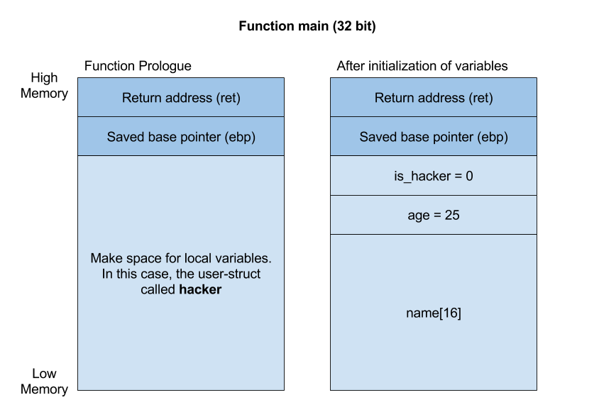

# Brewing of Pwntions: Stack overflow introduction

Hi class! Welcome to the first lecture of Introduction to Pwntions. We will 
start the class by explaining the memory and the stack of runnable programs.

Stack overflows are common in programs where the programmer has to manage memory
manually. Such programming languages are often called low level languages, 
because they 
are closer to the hardware of the machine it is running on. The C programming 
language is a very good example of that, and is very common in the pwn category 
in hacking competitions. Other programming languages such as Java, C#, and 
Javascript are high level programming languages where the system manages 
everything that has to do with the memory and stack. For instance, let's say the 
programmer wants to read text from a file. In Java or C# she does not need to 
specify the amount of space required to read the file into a variable. Using the 
C programming language, she will have to specifically set an amount of space 
that the variable will be allowed to use. Setting this space is called 
**allocating** space, and the function **malloc** is one of the ways to 
allocate space. I will show you an example in one of the coming classes. In 
other words, she must specifically handle files with more text than the 
variable has room for when using C, while Java and C# will handle that for the 
programmer. This is just a fun fact to make it clear why we always use C in 
pwn, and nothing important to pass the exams later on.


<details>
  <summary>High level and low level programming example</summary><p>

In each of the exams for this class, you are presented with a C program. The 
programs reads a file, and outputs it as the banner of the task. 
Let's take a look at how this is done in Python, and then in C. Both programs
simply reads a file called `banner.txt`, and prints its content to the
terminal. Here's the Python script:

```python
1	banner_file = open("banner.txt","r")
2	
3	banner = banner_file.read()
4	
5	print(banner)
6	
7	banner_file.close()
```

In this Python snippet, we do four simple things.

* Line 1: Open the file
* Line 3: Read the content of the file
* Line 5: Print the banner
* Line 7: Close the file

We do not have to worry about how big the banner file is, or how much space the
program needs to run it. 

The C program in the snippet below does the same four things, but also
has a few additional interesting lines worth discussing. This program has 
to specify the amount of space needed to read the file. Let's start by taking
a look at the lines that does the same as in the python script:

* Line 10: Open the file
* Line 22: Read the content of the file
* Line 27: Close the file
* Line 29: Print the banner

Now, we pick the lines that are important when discussing low level 
programming compared to high level programming. Let's skip everything else 
than the lines 17, 18, and 31, as those are the only important ones:

* Line 17: Set the `size` variable to the size of the file's content.
* Line 18: This is the special part for low level programs!! A function 
called `calloc()` is called. _Calloc_ allocates space for a variable.
* Line 31: Free the space allocated for the `buf` variable. If we forget 
to free allocated space, the machine may run out of memory.

The definition of memory allocation is as follows: 
```
Memory allocation is a process by which computer programs and services are 
assigned with physical or virtual memory space. Memory allocation is the 
process of reserving a partial or complete portion of computer memory for the 
execution of programs and processes.
```

Simply put, we must make space for a certain amount of data. In our case, we 
specify that the variable `buf` should have as much space as the integer 
variable `size` holds. 

```C
 1	#include <stdlib.h>
 2	#include <stdio.h>
 3	
 4	static void print_banner(void)
 5	{
 6		FILE *fp;
 7		char *buf;
 8		size_t size;
 9	
10		fp = fopen("banner.txt", "r");
11		if (!fp) {
12			perror("fopen(banner.txt)");
13			exit(EXIT_FAILURE);
14		}
15	
16		fseek(fp, 0, SEEK_END);
17		size = ftell(fp);
18		buf = calloc(1, size);
19		rewind(fp);
20	
21		/* -1 to drop newline */
22		if (fread(buf, size - 1, 1, fp) < 1) {
23			perror("fread()");
24			exit(EXIT_FAILURE);
25		}
26	
27		fclose(fp);
28	
29		printf("%s\n", buf);
30	
31		free(buf);
32	}
33	
34	int main(void)
35	{
36		print_banner();
37	
38		return 0;
39	}
```

Note that whenever this code is in a task, you may ignore it. It is simply put
there to print a nice banner, not to find vulnerabilities in.

</p></details>

<br>

_______

All of the exams are quite simple if one understands the stack and memory 
layout. However, understanding the stack and memory layout itself isn't that 
simple. They control pieces of information that the program needs to 
do its job. For instance if a program needs to make a variable that is used
throughout the program, then it needs to be stored somewhere in memory on the machine. 
That somewhere is usually on the stack. A memory layout describes how the memory
is built for a specific program. The stack is one of many parts of the memory 
layout. For this class, we focus on the stack and everything else is irrelevant.

Let's start by drawing an example of the memory layout of a C program, but only
include the stack:



The illustration above shows us two stack frames. A stack frame is the memory layout 
for a function. Functions are ways to put the code into chunks, making the code
reusable, clean, and readable. Let's take a look at a C program and point out 
the three functions:

```C
#include <stdio.h>

static void do_random_stuff()
{
	printf("Doing random stuff\n");  
}

static void print_a_line()
{
	printf("Printing a line\n");
}

int main() 
{
	printf("Starting program here!\n");
  
	/* Calling functions from the main function*/
	do_random_stuff();
	print_a_line();
	do_random_stuff();

	return 0;
}
```

Did you see the functions? They are as following, `main()`, `do_random_stuff()`
, and `print_a_line()`. The main function is the entry point of every C program.
It means that whenever you read a C program, this is where to start reading.
Then we see that the main function calls the other two functions before exiting
the program with `return 0;`.

Now that we know what a function is, let's continue learning about the stack 
frame. The drawing on the left shows the prologue of the stack frame. It sets 
up the stack and registers that the function will use. In other words, 
the prologue prepares the function before it is used. In these preparations,
the return address (ret) and the saved base pointer (ebp) are pushed onto the 
stack from the previous stack frame, and space is allocated for the local 
variables of the function.

The return address is at the top of both stack frames in the illustration. It 
is an address to the previous stack frame so that the current function knows 
where to return after finishing running through its code. 

The base pointer is pushed on the stack after the return address. It is on the 
stack in order to know how to find the local variables. It is not super 
important to understand what the return address and the saved base pointer 
really are for the exams, but it is really important that you know where the 
return address is placed on the stack frame!

Lastly, the stack frame makes space for all the local variables in the function.

Let's take a look at the C program for this illustration:

```C
#include <stdlib.h>
#include <stdio.h>
#include <unistd.h>
#include <stdbool.h>

struct user {
	char name[16];
	int age;
	bool is_hacker;
} __attribute__((packed)); /* the attribute makes sure that there is no padding between struct members */

int main() 
{
	struct user hacker;
	hacker.is_hacker = 0;
	hacker.age = 25;

	setvbuf(stdout, NULL, _IONBF, 0);
	printf("Hey, hacker! What's your name?\n");

	read(STDIN_FILENO, hacker.name, 30);

	if (hacker.age == 25 && hacker.is_hacker == 1) {
		printf("You made it! Hackers dont have an age limit!\n");
		system("/bin/sh");
	} else {
		printf("Oh noes, you're not old enough to be a hacker!\n");
	}

 	return 0;
}
```

The illustration is of the above program's main function. The only local 
variable in _main_ is the struct, which is the first declared variable in the function, 
`struct user hacker`. You will later learn about what a struct is,
but for now, think of this struct as a variable that can contain members.
Members are variables inside of the struct.

The memory layout drawing to the right shows the stack frame of the main 
function when all the variables have been initialized with a value. We can see 
that the variables are ordered in the same way as it is defined in the 
struct, which is something that always happens with values in structs. 

Alright, quite heavy start for this class.. With a little training, you will 
understand that it is not as hard as it might seem. Please stop by my office
at the TG:Hack area in the Creative lounge if it is hard to understand!
Remember that you can always search on _Google_ for new technical words you haven't heard
about before, in order to learn more about the topic. We at the TG:Hack crew often use
_Google_ when we are uncertain about something!

See you in the next class. We will learn about manipulating the stack to show 
us a secret value that no one is ever supposed to see!
