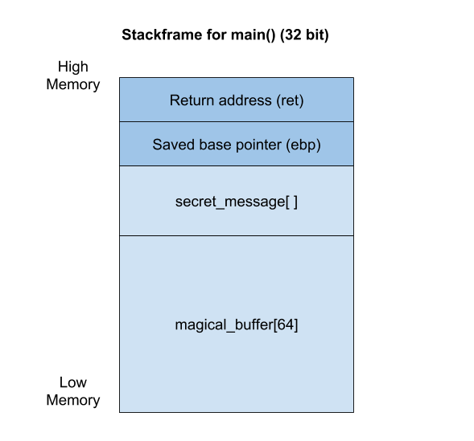
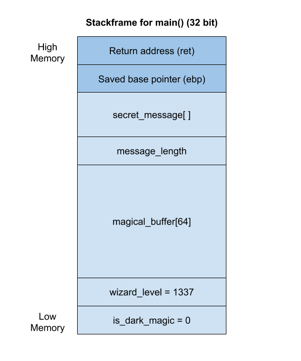
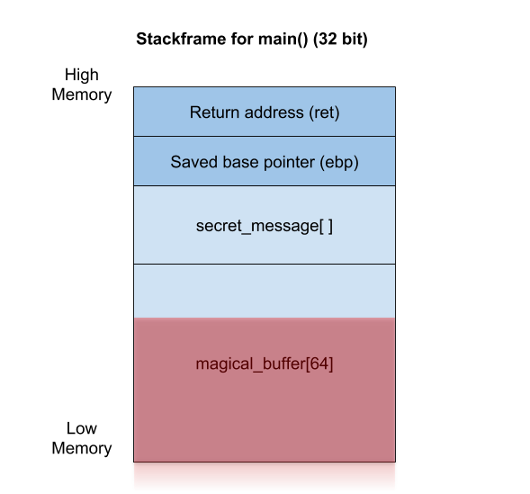
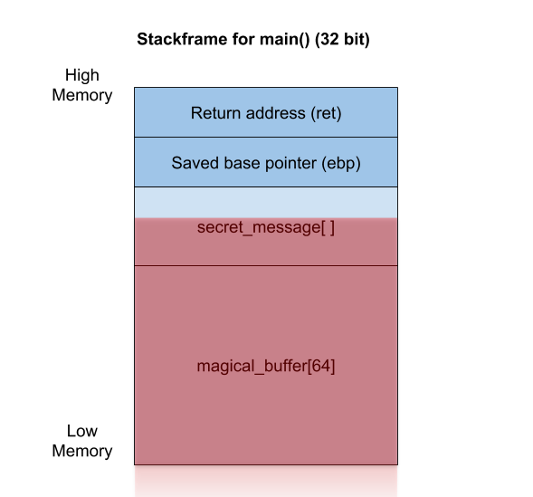

# Brewing of Pwntions: Stack overflow pt. 1

Hi class! Welcome to the second lecture of Introduction to Pwntions. This is
the first lecture with practical content.
I have brought a house elf to this class. His name is Pwnie. He has a rare
condition making him vulnerable to an ancient type of pwntions - namely 
**stack overflows**. To get a detailed introduction to stack overflows, take
a look at the previous lecture!

So, our house elf Pwnie. Poor guy. We will make pwntions in this and
the following classes, and test them on him. But don't feel bad, he will not 
feel any pain.

---

<br>

First, it is very useful to look at the source code:

```C
#include <stdio.h>
#include <unistd.h>

int main(void)
{
	/* Declare variables */
	char secret_message[] = "TG19{This_is_a_dummy_flag}";
	char magical_buffer[64];

	/* Send output to terminal */
	setvbuf(stdout, NULL, _IONBF, 0);
	printf("Give me some magical spell!\n");

	/* Fetch input */
	read(STDIN_FILENO, magical_buffer, 128);

	/* Print name to terminal */
	printf("%s\n", magical_buffer);

	return 0;
}
```

Do you remember the stack frame examples from the introduction class? Let us 
take a look at a similar illustration for the above source code:
  


We want to brew the pwntion so that Pwnie tells us his secret message. The 
secret message is placed underneath the saved base pointer in the illustration,
named as `secret_message`. In order to make this pwntion right, we have to 
overwrite the null value of the variable that is placed on the stack before the 
secret message. Think about that for a second.. The variable before the secret
message..

Which value on the stack is located before the secret message, and which is
located after? What comes first? It depends on the system really, but our systems 
store the return address at the high memory, while the local variables are 
stored in the low memory. When reading the stack, we go from low to high. 
However, every value put on the stack is inserted from high to low memory.
For instance, in the code above, we declared the variable `secret_message` first,
and then the variable `magical_buffer`. Therefore, `secret_message` is at the 
high memory, above `magical_buffer`. If it is still unclear, take a look at 
the example with five variables below. 

<details><summary>Example with five variables</summary><p>
	
	Let's say we have five variables in the code instead, getting a source
	code like the snippet below:
	
```C
#include <stdio.h>
#include <unistd.h>

int main(void)
{
	/* Declare variables */
	char secret_message[] = "TG19{This_is_a_dummy_flag}";
	int message_length;
	char magical_buffer[64];
	int wizard_level = 1337;
	int is_dark_magic = 0;

	/* Send output to terminal */
	setvbuf(stdout, NULL, _IONBF, 0);
	printf("Give me some magical spell!\n");

	/* Fetch input */
	read(STDIN_FILENO, magical_buffer, 128);

	/* Print name to terminal */
	printf("%s\n", magical_buffer);

	return 0;
}
```

	As mentioned in the stack overflow introduction, the return address 
	and the saved base pointer are put on the stack in the function 
	prologue, so they are on the stack before declaring all the 
	variables in the function. The code always starts at the main() 
	function, and then we read from top to bottom. Firstly, the 
	`secret_message` is put on the stack, at high memory underneath 
	the return value and the saved base pointer. The next variable, 
	`message_length`, is put underneath the `secret_message`. Then 
	`magical_buffer` is put underneath, followed by `wizard_level`, 
	and lastly, `is_dark_magic`. This is illustrated in the picture 
	below.


</p></details>

<br>

Although the variables are put into the stack from high to low memory, all 
the input we insert fills up the variables from low to high memory within
that variable. Therefore, our buffers are overflowed towards high memory. 
Let's take a look at this in the illustrations below.

To begin with, we start filling up the `magical_buffer` buffer in the local 
variables. Our buffer has room for 64 bytes. Each character use 1
byte of space. So let's write a message of 48 characters/bytes. Then the buffer 
has room for 16 more bytes before it is full. Everything looks fine in our
illustration, where the pink color is the 48 bytes of input:



Let us insert another 32 bytes, which equals 80 bytes of input into the buffer.
As we had room for 64 bytes, we have an excessive 16 bytes. These excessive 16
bytes writes over 16 bytes worth of values after the buffer. In the illustration
below, we see that the `magical_buffer` is full, and the 16 first bytes of the 
`secret_message` is replaced with our input.



---

<br>

Now, we've looked at overwriting values on the stack by inserting more data than
the buffer has room for. The next step is to build the insert string. The string will 
overwrite the values exactly how we want the stack to look like. This will manipulate
the program to act the way we would like it to.

Let's build an input string together! In this class' topic, we have a special
mission. A vulnerability allowing us to leak the secret message, is writing our
input so close to the secret message that the program will think the secret 
message is a part of our magical spell buffer. Next time the buffer is 
printed to our terminal, the secret message will appear as well.

Why is that professor maritio\_o, you may ask? Well, the reason is that all 
C strings are terminated by a _null_-value. A null value looks like this: _0x0_.
If the null value is not present, the program will think the next bytes are part 
of the variable as well.

We know a few things by looking at the source code:
* the buffer has room for 64 bytes by looking at the `magical_buffer` buffer in 
the source code. (64 byte buffer = 63 bytes input + null byte).
* the program allows for reading 128 bytes from the user input.
* we want to write input that exactly overwrites the buffer and its null 
value.

<details><summary>Tip for input</summary><p>

	It is common in pwntions to build a string using lots of A's. The A's are used
	for padding. Padding just means the values that are insignificant of value. In 
	other words, it doesn't really matter what input we send. We use A's because 
	the hex value of A is `0x41`. That means that when debugging the program, we 
	know where our padding is placed, because we may look for tons of `0x41`'s.
</p></details>

<br>

With that information we can build an input string like this
```
"A" * 64
```

... and insert it to our local program to test it:
```
$ python -c 'print "A" * 64' | ./pwn_intro1
```

If it works locally on your machine, you should be ready for the exam! The exam 
use something called _netcat_ (nc). A hot tip is to replace the binary file
you test with locally on your machine with the url and port that netcat use
to connect to the server. Then your input will be sent to the server. 

<details><summary>netcat example</summary><p>

netcat to remote server without input, just to test task:
```
$ nc url.tghack.no 1337
```

Here, 1337 is the port number specified in the task description. 
The example below shows how to connect to the remote server and send 
input at the same time.

```
$ python -c 'print "A" * 64' | nc url.tghack.no 1337
```
</p></details>

<br>

Go on, build the magical spell to overwrite the null value of the magical spell
buffer, and fetch the flag! It is the first task of the exam in the pwn
category on the challenges page. Good luck!
