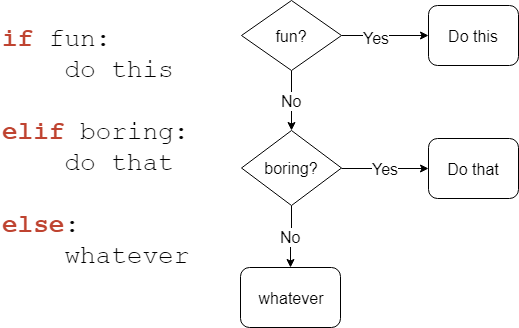

# Boolean operators, if-statements and loops


In this lesson you learn about the functionality that can be used to control the flow
of our code, such as boolean operators, if-statements and loops. Using this knowledge, 
you will be able to create more complex scripts than using only variables,
print functions and math. Let's begin the lesson, I hope you brought your tinfoil hats
for this one!

<br>

## Boolean operators

A boolean expression (or logical expression) evaluates to one of two states; _true_ or _false_.
Python provides the boolean type that can be either set to `False` or `True`.
Many functions and operations return boolean objects.

Every object has a boolean value. The following elements are false:

- `None`
- `False`
- `0` (Zero is false for all number types: integers, floats, complex numbers, etc.)
- Empty collections: `''`, `()`, `[]`, `{}`
- Objects from classes that have the special method `__nonzero__`
- Objects from classes that implements `__len__` to return `False` or `0`

If an object is not in any of the categories above, it's usually `True`.

There is also a way to inverse a boolean type:
```python
print not True
print not False
```
As the output of the print statements illustrate below, _True_ becomes _False_, and _False_ becomes  _True_ when you put _not_ in front of it.
```
False
True
```

The `not` keyword is very useful and is used a lot with comparison operators and if-statements.
Let's test different types and values by printing a string containing a value, followed 
by an equal sign ('=') and the _int_ or _bool_ representation of the same value:
```python
print "True  = ", int(True)
print "False = ", int(False)
print "1     = ", bool(1)
print "0     = ", bool(0)
print "-0.87 = ", bool(-0.87)
print "'g'   = ", bool('g')
print "''    = ", bool('')
```
The output below demonstrates what was mentioned earlier - that each object has a boolean value.
For instance, we see that an empty string is False, while a string containing a _g_ is True.
Similarly, the number 0 is False, while the number 1 is True.
```
True  =  1
False =  0
1     =  True
0     =  False
-0.87 =  True
'g'   =  True
''    =  False
```

<br>

### Comparison operators
The comparison operators compare the values of two objects and return either `True` or `False`.
The type of comparison is based on one of these operators:
- \< (less than)
- \<= (less than or equal to)
- \> (greater than)
- \>= (greater than or equal to)
- == (equal to)
- != (not equal to)

```python
print 10 == 10
print 3 < 9 <= 10
print 6 > 10
print "Lesson 5" == "Lesson 5"
```
```
True
True
False
True
```

Okay, so what happened here? In the first line we compare two numbers to check if
they are equal; `10` and `10`. They are equal so that means the result must be true.
The next comparison is a bit more complicated. Here we check that `9` is greater than `3`,
but at the same time less than or equal to `10`. This also seems to be true.
However in the next comparison we see that `6` is not greater than `10`, so the result is false.
Comparisons can also be used on strings or any other type of object.

[More on boolean and comparison operators](https://thomas-cokelaer.info/tutorials/python/boolean.html)

<br>

### _AND_ and _OR_
To combine multiple comparisons you can use the _and_ and _or_ keywords.
- `and` is true if both values on each side of `and` are true.
- `or` is true if one of the values on each side of `or` is true

```python
a = 1
b = 0
c = 0

print a and b
print a and not c
print a or b
```
```
False
True
True
```
We already know that 1 equals True and 0 equals False. So the first line compares _a_ to _b_ with
the comparison method _and_. It returns False because they to not contain the same boolean value.
For the next line, we compare _a_ to the inverted value of _c_ using the same comparison operation. 
Both are True, so the comparison returns True. In the last line, we compare _a_ to _b_, 
however this time there is another comparison operator, _or_. As one of the values are True, the 
_or_ comparison returns True. 

<br>

## Conditional statements (If statements)
In our daily life we need to make decisions all the time. __If__ it's cold outside then I'll
grab a jacket, __otherwise__ I'll use a T-shirt. __If__ it's a weekday then I go to work, __otherwise__
I chill at home. It's not that simple in the real world, since there can be lots of answers to different
questions. The essence here is that we evaluate conditions and act upon the result.
An if statement checks whether a value or comparison is `True` or `False`. The code block inside the
if statement gets executed if the result of the comparison is `True`.
Indentation is what tells the interpreter which code belongs to the if statement.
Most people indent using four spaces, but some like to indent using tabs.

An if statement consists of three parts:
1. `if` - Can be used alone or extended with `elif` or `else`. It checks a comparison. If the comparison 
is `True`, the
indented code block inside `if` is executed.
2. `elif` - Works the same way as `if`, but has to come after an `if`. If `if` is `False` then go
to `elif`, if it is present.
3. `else` - If all tests above are False, then execute code block inside of `else`.

Check out this figure to understand the flow of if statements:



<br>

```python
lst = ['x', 'y', 'z']
a = 0
b = 1

if a:
    print a
elif a > 4:
    print 'a is greater than 4'
elif 'y' in lst and b:
    print ', '.join(lst)
else:
    print a - b
```
```
x, y, z
```
By now, you might be comfortable with the boolean variables and understand why we 
get the output, but we will explain it either way.  First, we initialize three variables, the 
list _lst_, _a_, and _b_. Then we get to the if-statement. The `if` checks whether _a_ 
is True. It is not, so we skip the indented part and continue to the `elif`. It checks if _a_ 
is larger than 4, but it is not. So we move on to the next `elif`. This one returns True 
because both the character _y_ is a part of the list and _b_ is True. Notice the comparison 
operation in the middle. As it returns returns True, we execute the indented code. The
indented code returns a string containing each element of the list with a comma between 
them, hence `x, y, z`.

<br>

## Loops

Every line of code in a Python script gets executed sequentially. Sometimes we want
to execute a block of code several times. For example if we want to make a countdown
timer, using a loop is a smart choice. Inside of a loop we can subtract `1` from the current
count and wait `1` second. This way we don't have to write the same code multiple times.
There are two types of loops: `for` and `while` loops.

Loops use indented code blocks just like if statements. The indented code is what is
going to get repeated until the loop is done iterating.

<br>

### For loops
For loops iterate over a given sequence. Check out this example:
```python
for number in [2, 4, 6, 8]:
    print number
```
The code in the snippet above outputs:
```
2
4
6
8
```

The next example is pretty straightforward. Instead of specifying every number in a sequence there
is a function called `range` or `xrange` (for Python 2.7). With `range` we can specify a range of
numbers to iterate over. The `range` function takes 3 parameters (_start_, _stop_, _step_), but only 1
is required. If you only use 1 parameter, the number you choose becomes _stop_, the _start_ parameter defaults to 0
and _step_ defaults to 1. The sequence of numbers then increment by 1 and will range from
`0` to `[your number] - 1`. That is because all numbers are checked that they are less than (`<`) _stop_.
The last parameter, _step_, specifies how many steps at a time the number will increase by.
```python
# Prints 0, 1, 2, 3, 4, 5
for x in xrange(6):
    print x

# Prints 8, 9
for x in xrange(8, 10):
    print x

# Prints 2, 4, 6, 8
for x in xrange(2, 10, 2):
    print x
```

<br>

### While loops
While loops repeat as long as a certain boolean condition is met. When the condition is `False` the
`while` loop stops. Let's take a look at an example:

```python
count = 0
while count < 8:
    # In Python 2.7, if a print statement ends
    # with comma, it won't print a newline.
    print count,
    count += 1
```
```
0 1 2 3 4 5 6 7
```

This script prints a count for every iteration of the loop. First we set the `count` variable
to `0`. Then we have a `while` loop that does two things. It prints `count` and increases `count` by `1`. For every iteration
the program checks if the value of `count` is less than `8`. If that boolean condition is met, it enters the 
indented code and executes it. Afterwards, it goes back to check whether the boolean condition is still 
met. And so it continues until the boolean condition returns False. In our case, the condition is `False` 
when the value increases to `8`, 
and the loop stops.

<details>
  <summary>Have you heard about infinite loops or endless loops?</summary><p>
  Infinite loops, also called endless loops, are loops that never stop. They just run and
  run, and never get to continue running the code after the loop. These loops either 
  don't have any terminating condition, have a condition that can never be met, or 
  they have a condition that makes the loop start over.

  Following is an example of an infinite loop. The condition is always True, and nothing can
  ever make it False. The script will print `Infinite Loop` until manually stopped by the user:
  ```python
  while True:
      print("Infinite Loop")
  ```
  (If you actually run this code, press Ctrl+C to stop the script.)

  Read more about infinite loops [here](https://en.wikipedia.org/wiki/Infinite_loop).
</p></details><br>

### "Break" and "continue"
A last important thing to know about before you start creating loops is the `break` and `continue` statements.
`break` is used to exit a loop before it is supposed to finish. On the other hand `continue` is used to skip
the rest of the block inside the loop and then continue on the next iteration of the loop.

```python
# Prints 5, 4, 3, 2 and breaks loop
countdown = 5
while True:
    print countdown,
    countdown -= 1
    if countdown < 2:
        break
```
```python
for x in xrange(4):
    # Skips printing 2 and continues on the next iteration
    if x == 2:
        continue
    print x
```
The code snippets above output the following: 
```
5 4 3 2
```
```
0
1
3
```

That was a lot of stuff! Now you've been through _boolean operators_, _if-statements_,
and _loops_. These concepts are essential parts of any programming language, so this is
very valuable knowledge. Hope you didn't lose your tinfoil hats!

In the next part, we will tackle functions, classes, and modules. Good luck!
